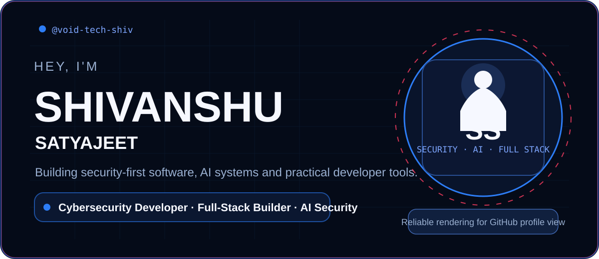
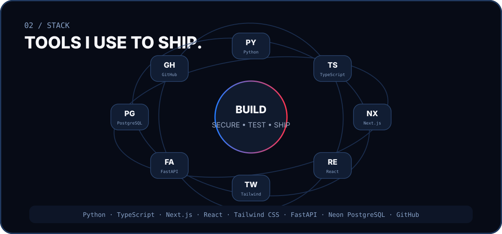
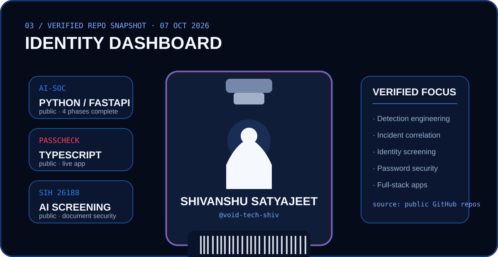
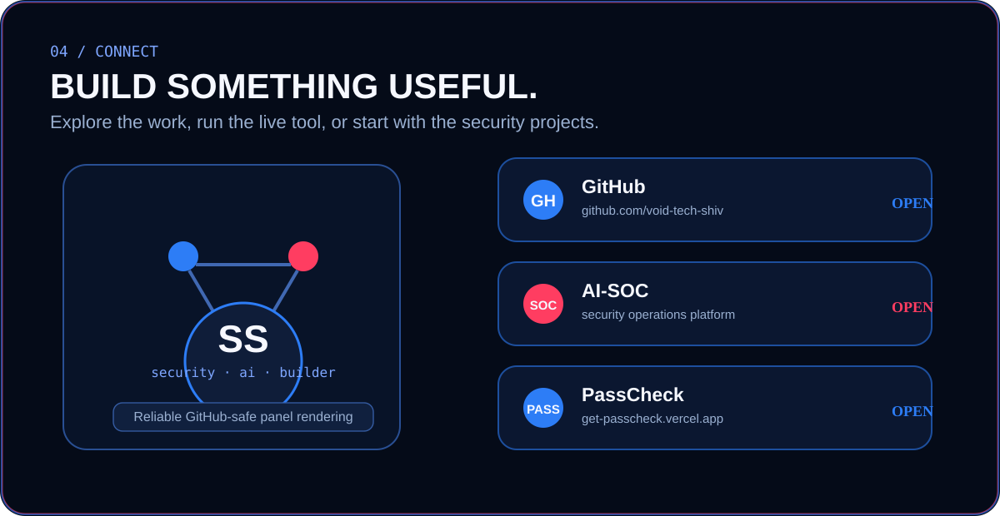

## Featured projects

| Project | What it does | Stack / status |
|---|---|---|
| **[AI-SOC](https://github.com/void-tech-shiv/AI-SOC)** | AI-powered cybersecurity operations platform with synthetic log ingestion, deterministic detections, alert management, incident correlation and priority scoring. | Python · FastAPI · Next.js · Neon PostgreSQL |
| **[AI Identity Document Screening — SIH 26188](https://github.com/void-tech-shiv/AI-Based-Fake-Identity-Document-Screening-System-SIH26188)** | Prototype for identity and travel-document screening using OCR, MRZ validation, tampering detection, face verification and explainable risk assessment. | Python · AI / document security |
| **[PassCheck](https://github.com/void-tech-shiv/Passcheck)** | Privacy-focused password security checker for strength, entropy, patterns, crack resistance and known breach exposure, with password/passphrase generation. | TypeScript · [Live app](https://get-passcheck.vercel.app/) |

## Connect

- **GitHub:** [@void-tech-shiv](https://github.com/void-tech-shiv)
- **AI-SOC:** [github.com/void-tech-shiv/AI-SOC](https://github.com/void-tech-shiv/AI-SOC)
- **PassCheck:** [get-passcheck.vercel.app](https://get-passcheck.vercel.app/)

Profile visuals use GitHub-safe SVG panels with no embedded raster images.
